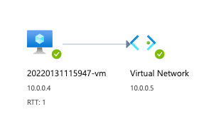

# Check latency between VM and Azure Cache for Redis in the same Zone and Vnet
Check latency between VM and Azure Cache for Redis in the same Zone and Vnet

Table of Contents
=================

- [Check latency between VM and Azure Cache for Redis in the same Zone and Vnet](#check-latency-between-vm-and-azure-cache-for-redis-in-the-same-zone-and-vnet)
- [Table of Contents](#table-of-contents)
  - [Requirements](#requirements)
  - [Usage](#usage)
    - [How to setup in az](#how-to-setup-in-az)
    - [Create a new Virtual Machine and a new Azure Cache for Redis P1](#create-a-new-virtual-machine-and-a-new-azure-cache-for-redis-p1)
    - [How to run redis-benchmark in VM](#how-to-run-redis-benchmark-in-vm)
  - [How to run Azure Network Watcher](#how-to-run-azure-network-watcher)
  - [Clean up](#clean-up)
  - [Log](#log)
    - [redis-benchmark](#redis-benchmark)
    - [Azure Network Watcher](#azure-network-watcher)
    - [Cleanup](#cleanup)

Created by [gh-md-toc](https://github.com/ekalinin/github-markdown-toc.go)

## Requirements

- [`az`](https://docs.microsoft.com/en-us/cli/azure/install-azure-cli)
- [`jq`](https://stedolan.github.io/jq/)
- Azure account

## Usage

### How to setup in az

Set up `az`

```console
$ az login
$ az account set -s <id or name>
```

### Create a new Virtual Machine and a new Azure Cache for Redis P1

```console
$ script/setup [-g RESOURCE_GROUP_NAME(Default: $PREFIX-resource-group)]
```

### How to run redis-benchmark in VM

```console
$ ssh xxxx@xxxx
# sudo apt-get update;sudo apt-get install -y redis
# redis-benchmark -h xxxx -p xxxx -a xxxxx -t get,set -c 10 -n 10000
```

## How to run Azure Network Watcher



[Network Watcher Agent virtual machine extension for Linux](https://docs.microsoft.com/en-us/azure/virtual-machines/extensions/network-watcher-linux)

```console
$ az vm extension set --resource-group <resource-group> --vm-name <vm> --name NetworkWatcherAgentLinux --publisher Microsoft.Azure.NetworkWatcher --version 1.4
```

[Troubleshoot connections with Azure Network Watcher using the Azure CLI](https://docs.microsoft.com/en-us/azure/network-watcher/network-watcher-connectivity-cli)

```console
$ az network watcher test-connectivity --resource-group <resource-group> --source-resource <vm> --dest-address <redis> --dest-port xxxx
```

## Clean up

```console
$ script/cleanup -g <resource-group>
```

## Log

### redis-benchmark

```console
$ script/setup
az group create   --name 20220128190422-resource-group   --location japaneast

Location    Name
----------  -----------------------------
japaneast   20220128190422-resource-group

az vm create   --resource-group 20220128190422-resource-group   --name 20220128190422-vm   --image UbuntuLTS   --vnet-name 20220128190422-vnet   --subnet 20220128190422-subnet   --generate-ssh-keys   --zone 1

ResourceGroup                  PowerState    PublicIpAddress    Fqdns    PrivateIpAddress    MacAddress         Location    Zones
-----------------------------  ------------  -----------------  -------  ------------------  -----------------  ----------  -------
20220128190422-resource-group  VM running    xxxx               10.0.0.4            00-22-48-E6-A9-11  japaneast   1

az deployment group create    --resource-group 20220128190422-resource-group   --parameters   location=japaneast   redisVersion=4   redisZone=1   redisCacheName=20220128190422-redis   redisCacheCapacity=1   existingVirtualNetworkResourceGroupName=20220128190422-resource-group   existingVirtualNetworkName=20220128190422-vnet   existingSubnetName=20220128190422-subnet   enableNonSslPort=true   minimumTlsVersion=1.2   --template-file azure/azuredeploy.json

Name         State      Timestamp                         Mode         ResourceGroup
-----------  ---------  --------------------------------  -----------  -----------------------------
azuredeploy  Succeeded  2022-01-28T10:17:28.200392+00:00  Incremental  20220128190422-resource-group

Complated!

----------------------------------------------------------------
# How to login to VM

ssh xxxx@xxxx

# How to install to Redis in VM
sudo apt-get update; sudo apt-get install -y redis

# How to connect to Redis from VM
redis-benchmark -h xxx -p xxx -a xxx -t get,set -c 10 -n 10000

# How to run Azure Network Watcher
az vm extension set --resource-group 20220128190422-resource-group --vm-name 20220128190422-vm --name NetworkWatcherAgentLinux --publisher Microsoft.Azure.NetworkWatcher --version 1.4

az network watcher test-connectivity --resource-group 20220128190422-resource-group --source-resource 20220128190422-vm --dest-address 20220128190422-redis.redis.cache.windows.net --dest-port 6379

# How to clean up
script/cleanup -g 20220128190422-resource-group

$
$ ssh xxxx@xxxx
The authenticity of host 'xxxx (xxxx)' can't be established.
xxxx key fingerprint is xxxx.
This key is not known by any other names
Are you sure you want to continue connecting (yes/no/[fingerprint])? yes
Warning: Permanently added 'xxxx' (xxxx) to the list of known hosts.
Welcome to Ubuntu 18.04.6 LTS (GNU/Linux 5.4.0-1067-azure x86_64)

 * Documentation:  https://help.ubuntu.com
 * Management:     https://landscape.canonical.com
 * Support:        https://ubuntu.com/advantage

  System information as of Fri Jan 28 10:47:31 UTC 2022

  System load:  0.08              Processes:           108
  Usage of /:   4.7% of 28.90GB   Users logged in:     0
  Memory usage: 5%                IP address for eth0: 10.0.0.4
  Swap usage:   0%

0 updates can be applied immediately.


The programs included with the Ubuntu system are free software;
the exact distribution terms for each program are described in the
individual files in /usr/share/doc/*/copyright.

Ubuntu comes with ABSOLUTELY NO WARRANTY, to the extent permitted by
applicable law.

To run a command as administrator (user "root"), use "sudo <command>".
See "man sudo_root" for details.

xxxx@20220128190422-vm:~$ sudo apt-get update; sudo apt-get install -y redis
 ...

xxxx@20220128190422-vm:~$ redis-benchmark -h xxx -p xxx -a xxx -t get,set -c 10 -n 10000
====== SET ======
  10000 requests completed in 1.15 seconds
  10 parallel clients
  3 bytes payload
  keep alive: 1

99.83% <= 1 milliseconds
99.97% <= 2 milliseconds
100.00% <= 2 milliseconds
8726.00 requests per second

====== GET ======
  10000 requests completed in 0.63 seconds
  10 parallel clients
  3 bytes payload
  keep alive: 1

97.32% <= 1 milliseconds
99.81% <= 2 milliseconds
99.87% <= 3 milliseconds
99.98% <= 6 milliseconds
100.00% <= 9 milliseconds
15772.87 requests per second
```

### Azure Network Watcher

```console
$ az vm extension set --resource-group 20220128190422-resource-group --vm-name 20220128190422-vm --name NetworkWatcherAgentLinux --publisher Microsoft.Azure.NetworkWatcher --version 1.4
AutoUpgradeMinorVersion    Location    Name                      ProvisioningState    Publisher                       ResourceGroup                  TypeHandlerVersion    TypePropertiesType
-------------------------  ----------  ------------------------  -------------------  ------------------------------  -----------------------------  --------------------  ------------------------
True                       japaneast   NetworkWatcherAgentLinux  Succeeded            Microsoft.Azure.NetworkWatcher  20220128190422-resource-group  1.4                   NetworkWatcherAgentLinux

$ az network watcher test-connectivity --resource-group 20220128190422-resource-group --source-resource 20220128190422-vm --dest-address 20220128190422-redis.redis.cache.windows.net --dest-port 6379

This command is in preview and under development. Reference and support levels: https://aka.ms/CLI_refstatus
AvgLatencyInMs    ConnectionStatus    MaxLatencyInMs    MinLatencyInMs    ProbesFailed    ProbesSent
----------------  ------------------  ----------------  ----------------  --------------  ------------
1                 Reachable           2                 1                 0               66
```

### Cleanup

```console
$ script/cleanup -g 20220128190422-resource-group
az group delete --name 20220128190422-resource-group
Are you sure you want to perform this operation? (y/n): y
```
